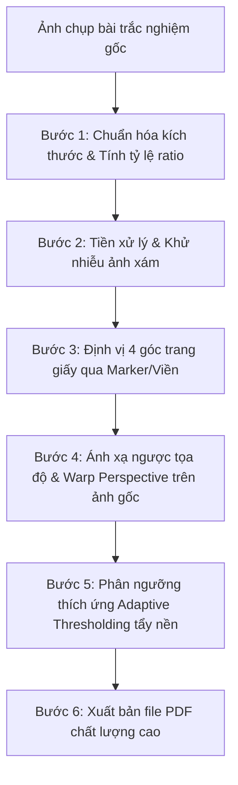

# Báo cáo Tóm tắt Đề tài và Pipeline Hệ thống Quét Tài liệu (Smart Document Scanner)

Tài liệu này tóm tắt mục tiêu, các thách thức kỹ thuật cốt lõi, phương pháp xử lý ảnh được vận dụng và các bước cụ thể cần thực hiện để đạt được mục tiêu cuối cùng là scan ảnh chụp bài trắc nghiệm ra định dạng PDF chất lượng cao.

## 1. Đặt vấn đề và Mục tiêu giải quyết

Người dùng thường chụp tài liệu (phiếu trắc nghiệm, hóa đơn, trang sách) bằng camera điện thoại trong các điều kiện không chuẩn. Hệ thống cần giải quyết 4 khó khăn kỹ thuật chính sau:

| Thách thức Kỹ thuật                        | Chi tiết vấn đề                                                                                                                                                   |
| :--------------------------------------------- | :-------------------------------------------------------------------------------------------------------------------------------------------------------------------- |
| **Độ phân giải không đồng nhất** | Ảnh đầu vào dao động từ HD (2MP) đến cực cao (108MP). Áp dụng bộ lọc với tham số cố định sẽ làm mất chi tiết hoặc không lọc được nhiễu. |
| **Biến dạng phối cảnh**              | Ảnh chụp bị nghiêng góc, méo hình thang, hoặc xoay lệch hướng.                                                                                             |
| **Nhiễu & Bóng mờ**                   | Ảnh chụp thực tế bị rung mờ, hạt nhiễu cảm biến, hoặc có bóng xám không đều do ánh sáng môi trường.                                             |
| **Chất lượng số hóa**               | Cần xuất bản thành file PDF rõ nét, chữ đen đậm và nền trắng tinh khiết như máy scan chuyên dụng.                                                   |

---

## 2. Các Bước Cần Thiết Để Đạt Tiêu Chí Đề Bài (Từ ảnh chụp đến PDF)

Để số hóa thành công một bài trắc nghiệm từ ảnh chụp thực tế thành file PDF sắc nét, pipeline bắt buộc phải trải qua 6 bước xử lý tuần tự sau:

### Bước 1: Chuẩn hóa độ phân giải và Lưu tỷ lệ (Scale Normalization)

* **Mục tiêu:** Giúp thuật toán hoạt động bất biến với độ phân giải của máy ảnh đầu vào.
* **Cách thực hiện:** Tính toán hệ số tỷ lệ co giãn (`ratio = chiều_cao_ảnh_gốc / 500.0`) và resize ảnh về chiều cao chuẩn `500px` để xử lý. Tất cả các tham số lọc ở các bước sau sẽ được tinh chỉnh tối ưu dựa trên kích thước chuẩn này.

### Bước 2: Tiền xử lý ảnh và Khử nhiễu (Preprocessing)

* **Mục tiêu:** Loại bỏ các hạt nhiễu cảm biến để tránh làm nhiễu thuật toán phát hiện biên.
* **Cách thực hiện:** Chuyển đổi ảnh sang ảnh xám (Grayscale) và áp dụng bộ lọc làm mịn **Gaussian Blur** với kernel `(5, 5)` để làm mịn các chi tiết nhiễu nhỏ trong khi giữ nguyên cấu trúc đường biên chính.

### Bước 3: Định vị chính xác 4 góc tài liệu (Corner Detection)

* **Mục tiêu:** Xác định tọa độ của 4 đỉnh góc của trang giấy. Đây là bước quyết định tính thành bại của hệ thống (phải đạt tỷ lệ chính xác $\ge 90\%$).
* **Cách thực hiện:** Hệ thống tự động điều phối qua 2 chế độ:
  1. **Chế độ tối ưu (Dành cho phiếu trắc nghiệm):** Phát hiện 4 ô vuông đen (Marker) định vị ở 4 góc giấy bằng cách nhị phân hóa Otsu, lọc contour theo diện tích phù hợp trên ảnh đã resize (`15` đến `300` pixel) và tìm các điểm cực trị ngoài cùng bằng **Bao lồi (Convex Hull)**.
  2. **Chế độ dự phòng (Fallback):** Áp dụng phát hiện cạnh **Canny**, tìm các contour kín lớn nhất và xấp xỉ đa giác tìm hình có đúng 4 góc (`approxPolyDP`).

### Bước 4: Ánh xạ ngược và Biến đổi phối cảnh trên ảnh gốc (Perspective Transform)

* **Mục tiêu:** Kéo phẳng trang giấy bị méo/nghiêng và phục hồi về dạng chữ nhật phẳng ở độ phân giải gốc cao nhất.
* **Cách thực hiện:**
  * Nhân tọa độ 4 góc tìm được ở Bước 3 với hệ số tỷ lệ `ratio` để có tọa độ tương ứng trên ảnh gốc độ phân giải cao.
  * Sắp xếp lại thứ tự 4 góc (`Trái-trên, Phải-trên, Phải-dưới, Trái-dưới`).
  * Sử dụng ma trận biến đổi phối cảnh từ `cv2.getPerspectiveTransform` và áp dụng `cv2.warpPerspective` trên ảnh gốc chất lượng cao để thu được ảnh phẳng rõ nét nhất.

### Bước 5: Phân ngưỡng thích ứng tẩy trắng nền (Adaptive Binarization)

* **Mục tiêu:** Khử hoàn toàn bóng mờ cục bộ do ánh sáng không đều và làm nổi bật phần chữ viết/các ô trắc nghiệm được tô.
* **Cách thực hiện:** Chuyển ảnh đã duỗi phẳng sang ảnh xám và áp dụng **Adaptive Gaussian Thresholding** (`cv2.adaptiveThreshold`). Bộ lọc này tính toán ngưỡng nhị phân độc lập cho từng vùng nhỏ giúp giấy có màu trắng tinh khiết (`255`) và các nét chữ/ô chọn có màu đen đậm (`0`).

### Bước 6: Đóng gói và xuất bản file PDF (Output Packaging)

* **Mục tiêu:** Tạo ra file PDF hoàn chỉnh, dung lượng tối ưu và sẵn sàng để in ấn hoặc nộp bài.
* **Cách thực hiện:** Chuyển đổi ma trận ảnh nhị phân ở Bước 5 sang định dạng ảnh của Pillow và lưu trực tiếp với tùy chọn xuất bản thành định dạng `"PDF"`.

---

## 3. Brainstorm Ngược: Phân tích Chuỗi Phụ thuộc (Backward Chaining Analysis)

Để hiểu rõ tại sao pipeline xử lý ảnh được thiết kế theo cấu trúc hiện tại, ta có thể phân tích ngược từ sản phẩm đầu ra mong muốn trở lại dữ liệu đầu vào gốc:

1. **Để có: File PDF hoàn chỉnh (Mục tiêu cuối cùng)**

   * **Cần có:** Ảnh nhị phân phẳng sạch bóng mờ (`T`).
   * **Phương pháp:** Chuyển mảng NumPy nhị phân thành ảnh PIL và gọi phương thức `save(..., "PDF")`.
2. **Để có: Ảnh nhị phân phẳng sạch bóng mờ (`T`)**

   * **Cần có:** Ảnh màu duỗi phẳng (`warped`) ở độ phân giải gốc cao.
   * **Phương pháp:** Áp dụng bộ lọc **Adaptive Gaussian Thresholding** cục bộ lên ảnh màu đã phẳng để triệt tiêu bóng tối không đồng đều, chuyển ảnh xám duỗi thẳng thành ảnh nhị phân đen-trắng hoàn toàn.
3. **Để có: Ảnh màu duỗi phẳng (`warped`) ở độ phân giải gốc**

   * **Cần có:** Ảnh gốc chất lượng cao (`orig`) và Tọa độ 4 góc chính xác trên ảnh gốc (`orig_pts`).
   * **Phương pháp:** Tính ma trận chuyển vị phối cảnh bằng `cv2.getPerspectiveTransform` dựa trên tọa độ 4 góc thực tế và duỗi thẳng ảnh bằng `cv2.warpPerspective`.
4. **Để có: Tọa độ 4 góc chính xác trên ảnh gốc (`orig_pts`)**

   * **Cần có:** Hệ số tỷ lệ co giãn (`ratio`) và Tọa độ 4 góc trên ảnh thu nhỏ (`screenCnt`).
   * **Phương pháp:** Nhân tọa độ tìm được trên ảnh resize `500px` với hệ số `ratio` (`screenCnt.reshape(4, 2) * ratio`).
5. **Để có: Tọa độ 4 góc trên ảnh thu nhỏ (`screenCnt`)**

   * **Cần có:** Ảnh đã chuẩn hóa kích thước (`image`) và một trong hai kết quả dò tìm:
     * *Nhánh 1 (Tối ưu cho bài trắc nghiệm):* Tọa độ tâm của 4 ô vuông góc (Marker).
     * *Nhánh 2 (Fallback cho tài liệu thường):* Đa giác 4 đỉnh bao ngoài tờ giấy.
   * **Phương pháp:**
     * *Nhánh 1:* Nhị phân hóa Otsu $\to$ Lọc contour ô vuông góc theo diện tích $\to$ Tìm bao lồi **Convex Hull** của các tâm để lấy 4 góc ngoài cùng.
     * *Nhánh 2:* Lọc Gaussian Blur $\to$ Phát hiện cạnh Canny $\to$ Tìm contour kín lớn nhất $\to$ Xấp xỉ đa giác `approxPolyDP` có đúng 4 góc.
6. **Để có: Ảnh chuẩn hóa kích thước (`image`) và Hệ số tỷ lệ co giãn (`ratio`)**

   * **Cần có:** Ảnh chụp đầu vào gốc từ camera (`orig`).
   * **Phương pháp:** Đọc ảnh gốc bằng `cv2.imread`, lấy kích thước gốc, tính tỷ lệ co giãn dựa trên chiều cao đích `500px` và thực hiện co giãn ảnh.

---

## 4. Kiến thức Xử lý ảnh vận dụng trong Pipeline

| Khái niệm / Thuật toán         | Vị trí áp dụng | Chương học | Vai trò cụ thể trong đề tài                                                                                     |
| :--------------------------------- | :----------------- | :------------ | :-------------------------------------------------------------------------------------------------------------------- |
| **Interpolation & Resizing** | Bước 1           | Chương 2    | Giữ nguyên tỷ lệ khung hình tài liệu khi resize ảnh.                                                          |
| **Gaussian Filtering**       | Bước 2           | Chương 2    | Khử nhiễu ảnh chụp camera điện thoại.                                                                          |
| **Otsu's Binarization**      | Bước 3.1         | Chương 4    | Tự động phân ngưỡng để phát hiện các ô vuông góc định vị.                                            |
| **Convex Hull**              | Bước 3.1         | Chương 4    | Lọc bỏ toàn bộ các ô trắc nghiệm và ký tự bên trong, chỉ giữ lại 4 ô định vị ở rìa ngoài cùng. |
| **Canny Edge Detection**     | Bước 3.2         | Chương 3    | Dò tìm các cạnh biên của tờ giấy khi không có ô định vị góc.                                           |
| **Polygon Approximation**    | Bước 3.2         | Chương 4    | Xác định chính xác 4 đỉnh từ viền trang giấy xấp xỉ đa giác.                                            |
| **Homography / Perspective** | Bước 4           | Chương 2    | Tính toán ma trận biến đổi và làm phẳng tài liệu.                                                          |
| **Adaptive Thresholding**    | Bước 5           | Chương 4    | Tẩy bóng mờ cục bộ, làm trắng nền giấy và rõ nét chữ viết.                                              |
